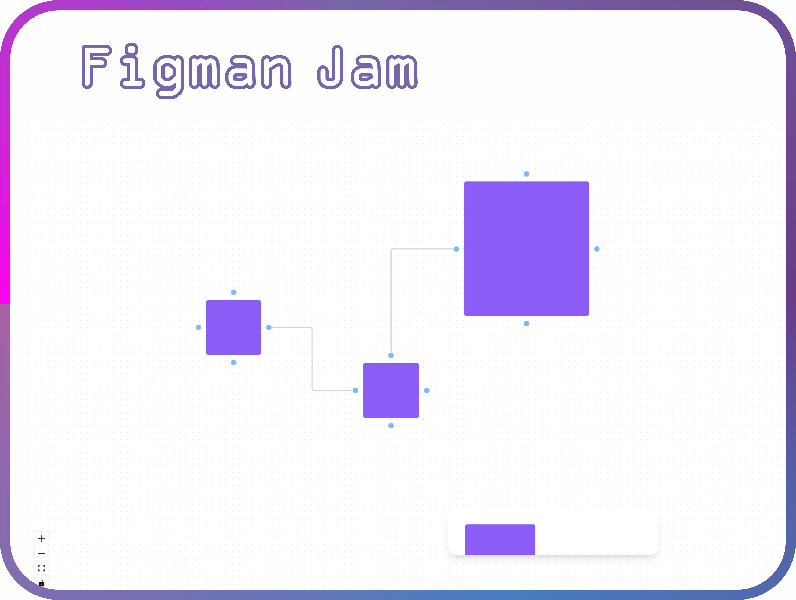

<h1 align="center"> FigJan Teste </h1>

Aprendizado com diversas tecnologias.  

  <a href="#-tecnologias">Tecnologias</a>&nbsp;&nbsp;&nbsp;|&nbsp;&nbsp;&nbsp;
  <a href="#-projeto">Projeto</a>&nbsp;&nbsp;&nbsp; 

 

  

## 🧭 Tecnologias

Esse projeto foi desenvolvido com as seguintes tecnologias:

### Front-end
+ `ReactJS + TypeScript`
+ `React Flow`
+ `Radix UI`
+ `Tailwindcss`

## Inicialização

### Client

  1º `$ cd FigmanJan`
  2º `$ yarn install`
  3º `$ yarn dev`

## 💻 Projeto

Recriando o Jam do Figma, simples mas de muito aprendizado...
Aula do Diego da RocketSeat 🚀.

Feito com ♥ by Maykon 
